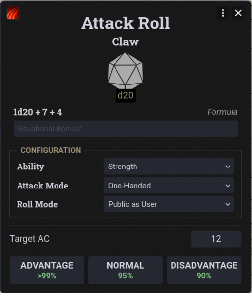
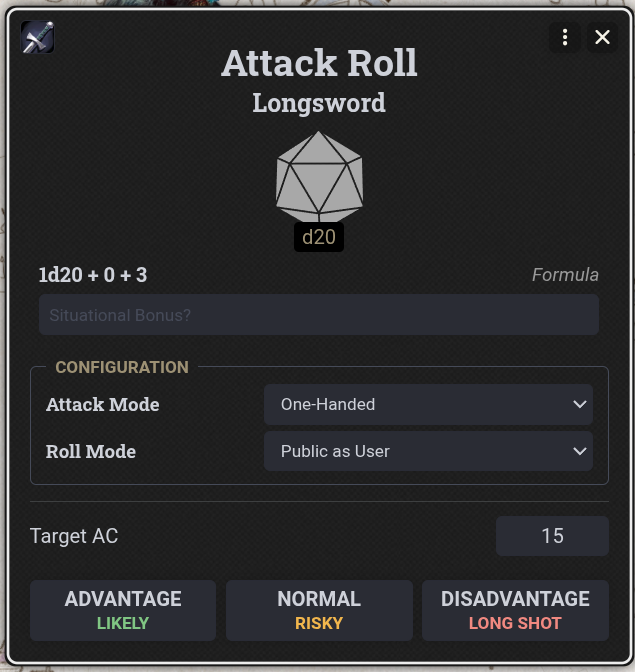
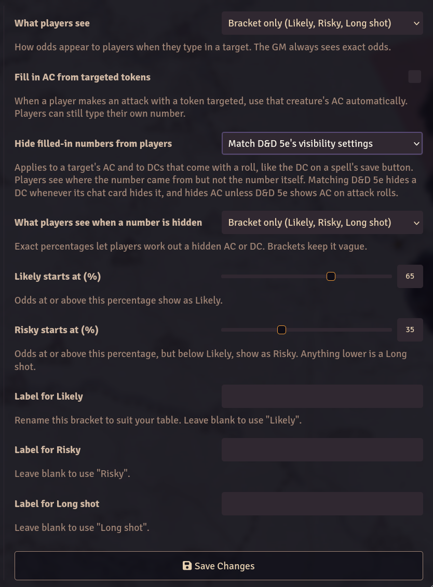

# Calculated Risk

Calculated Risk is a small Foundry VTT module for D&D 5e that shows your chance of success before you roll.

  
  

## Settings

Settings are under **Configure Settings --> Calculated Risk**.

You can choose whether players see exact percentages, simple labels like **Likely** or **Risky**, or nothing at all.

Calculated Risk can also pull AC from a targeted token.

### Hidden numbers

Some numbers are filled in for the player, like a target's AC or the DC on a spell's save button. The **Hide filled-in numbers from players** setting decides whether players see them:

- **Match D&D 5e's visibility settings** (default): a DC stays hidden whenever D&D 5e hides it on the chat card, and a target's AC stays hidden unless D&D 5e shows AC on attack rolls.
- **Always hide:** players never see a filled-in number.
- **Always show:** players always see it.

When a number is hidden, players see where it came from, like the creature's name, and odds show as a bracket by default so the number is harder to work out. Players can still type their own number instead. The GM always sees everything.

  

## Installation

### Manifest URL

1. From Foundry's **Setup** screen, open **Add-on Modules**.
2. Click **Install Module**.
3. Paste the module's manifest URL into the **Manifest URL** field:

   `https://github.com/BubbleMoth/Calculated-Risk/releases/latest/download/module.json`

4. Click **Install**.
5. Launch your world and go to **Game Settings -> Manage Modules**.
6. Enable **Calculated Risk**.

### Manual
Copy the `calculated-risk` folder into your Foundry `Data/modules` folder, restart Foundry, and enable **Calculated Risk** under **Manage Modules**.

## Compatibility

- Foundry VTT v14+
- D&D 5e 5.0+
- Built against D&D 5e 6.0.5

## How it works

Odds are calculated from the roll formula.

Some unusual formulas are not supported. If Calculated Risk cannot calculate a roll accurately, it will show the odds as unavailable instead of guessing.
